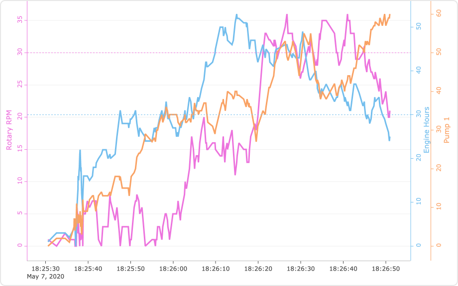

# Horizontal Line Chart Mod for Spotfire®

Display information as a series of data points connected by straight line segments similarly to a Spotfire line chart. The difference is that this visualization adds the ability to shade background over a specific range, to draw reference lines for a single axis and to individually color and label vertical axes.

## Installation & Use

[Download latest version](https://github.com/spotfiresoftware/spotfire-mod-horizontalline/releases)

The [Wiki](https://github.com/spotfiresoftware/spotfire-mod-horizontalline/wiki) contains step-by-step instruction on how to install and use this Mod in Spotfire®.

## Building the Project

In a terminal window:
- `npm install`
- `npm start`

## About Mods for Spotfire®
-   [TIBCO Community Exchange](https://community.tibco.com/s/global-search/%40uri#q=mod%20for%20tibco%20spotfire&t=Exchange&sort=date%20descending): A safe and trusted place to discover ready-to-use mods
-   [Developer documentation](https://tibcosoftware.github.io/spotfire-mods/docs/): Introduction and tutorials for mods developers
-   [Mods examples](https://github.com/TIBCOSoftware/spotfire-mods/releases/latest): A public repository for examples projects
